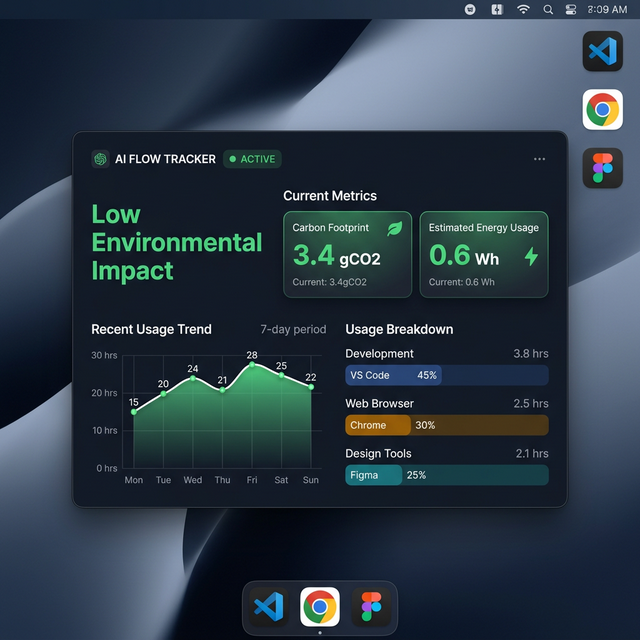

# Tech energy usage - AI Environmental Tracker

**Welcome!** This application is a lightweight, background friendly desktop widget designed to help you understand the environmental impact of your daily computer usage. As artificial intelligence becomes integrated into our workflows, it's important to be aware of the energy and carbon footprint those requests generate.

Built securely by **Real Code Ltd**.

---

## 🖼️ What it Looks Like

The dashboard runs right on your desktop, grading your environmental impact in real-time. It shifts from **Green** (Low Impact) to **Red** (High Impact).



---

## 🎯 What Does This App Do?

This app silently and securely tracks two things on your computer:
1. **The application you are currently using** (e.g., your web browser, design tool, or code editor).
2. **When your computer communicates with known AI services** (like ChatGPT, Claude, or Gemini) — *Windows only, see below.*

It then automatically categorizes your software to calculate a highly accurate estimate of your carbon footprint (gCO₂) and energy usage (Wh).
*Note: App categories and impact factors are fully customizable via a local `categories.json` file. See the 'Configuring Categories' section below for details.*

### Platform Feature Comparison

| Feature | Windows | macOS |
|---|---|---|
| Active window tracking | ✅ | ✅ |
| App category breakdown | ✅ | ✅ |
| Energy & carbon estimates | ✅ | ✅ |
| System tray icon | ✅ | ✅ |
| Settings & always-on-top | ✅ | ✅ |
| AI / network call tracking | ✅ (requires admin) | ❌ |

AI/network call tracking on Windows uses packet capture (Npcap) to detect outbound connections to known AI services. This feature requires Administrator privileges and is not available on macOS.

### Example: How we Calculate Impact
We map different types of software to different energy costs. Here is an example of the configuration rulebook the app uses to determine your footprint:

```json
{
  "base_metrics": {
    "network_api_calls": {
      "gCO2_per_call": 4.3,
      "wh_per_call": 3.0
    }
  },
  "category_multipliers": {
    "Development Environment": {
      "description": "Heavy compute, intensive compiler and indexing CPU bounds.",
      "gCO2_per_active_hour": 15.0,
      "wh_per_active_hour": 35.0
    },
    "Office Software": {
      "description": "Light compute, minimal battery impact.",
      "gCO2_per_active_hour": 4.0,
      "wh_per_active_hour": 10.0
    }
  }
}
```
*In the example above, spending an hour in a Development Environment consumes roughly 3.7x more energy than an hour in standard Office Software.*

### Configuring Categories & Application Detection

The app determines the category of your active software by reading the `categories.json` file automatically generated in your App Data directory:

*   **Windows:** `%LOCALAPPDATA%\com.realcodeltd.techenergyusage\categories.json`
*   **macOS:** `~/Library/Application Support/com.realcodeltd.techenergyusage/categories.json`

By default, it categorizes your software by checking the active window's process name and title against these predefined keywords:
*   **Development Environment:** `code`, `studio`, `idea`, `windsurf`, `antigravity`, `pycharm`, `eclipse`
*   **Web Browser:** `chrome`, `edge`, `firefox`, `brave`, `safari`
*   **Office Software:** `word`, `excel`, `powerpoint`, `notes`, `libreoffice`, `notepad`
*   **Design Tools:** `photoshop`, `illustrator`, `figma`, `blender`
*   **Communication:** `discord`, `teams`, `slack`, `whatsapp`
*   **Media Player:** `vlc`, `spotify`, `windows media player`
*   **Game Client:** `steam`, `epic games`, `battle.net`
*   **System Utilities:** `task manager`, `file explorer`, `explorer.exe`
*   **Security:** `windows security`, `malwarebytes`
*   **Other:** Any application that does not match the above keywords falls into this base category.

**How to customize your tracking:**
1. Open the app at least once so it generates the default `categories.json` file.
2. Navigate to your App Data directory (paths above).
3. Open `categories.json` in any text editor.
4. Add new keywords, adjust the environmental multipliers (`gCO2_per_active_hour`, `wh_per_active_hour`), or define entirely new categories to perfectly match your workflow!
5. Completely restart the Tech Energy Usage app for the changes to take effect.

---

## 🔒 Your Privacy is Guaranteed

We understand a background tracking app sounds concerning. **This application has been designed with strict privacy guarantees built right in.**

*   **Total Local Storage:** All data regarding what apps you use and when you access AI is stored **entirely on your own computer**.
*   **No Spying:** The app **never** sends your private usage history, chat logs, browsing history, or documents to Real Code Ltd.
*   **Passive Listening (Windows):** The app only looks at the outermost "envelope" of your internet traffic (specifically, reading the domain name like `api.openai.com`), not the "letter inside". It cannot read the content of your communications.

---

## 🚀 How to Install and Start Tracking

### Windows

**Step 1: Install Npcap**

The tracker needs a standard Windows tool called **Npcap** to safely monitor internet traffic envelopes.
*   Download the free installer here: [https://npcap.com/](https://npcap.com/)
*   Run the file and click "Next" through the default options.

**Step 2: Download and install the app**

1. Go to our **[Releases Page](../../releases/latest)**.
2. Under "Assets", download the `.msi` file.
3. Double-click the downloaded file to install it.
4. **Important:** Because the app needs to monitor your network, Windows may ask you to allow the app to run as an Administrator. Click **Yes**.

The app is now running securely on your desktop!

---

### macOS

**Step 1: Download the app**

1. Go to our **[Releases Page](../../releases/latest)**.
2. Under "Assets", download the `.dmg` file.
3. Open the `.dmg` and drag **Tech energy usage** into your **Applications** folder.

**Step 2: Open the app (Gatekeeper warning)**

Because the app is not yet distributed via the Mac App Store, macOS will block it on first launch with a message like *"cannot be opened because the developer cannot be verified"*.

To open it:
1. **Do not double-click** the app icon.
2. **Right-click** (or Control-click) the app icon and select **Open**.
3. In the dialog that appears, click **Open** again.

You only need to do this once. After that the app opens normally.

> **Note:** AI/network call tracking is not available on macOS. The AI call counter will remain at zero — all other features (energy tracking, category breakdown, system tray, settings) work fully.

---

## 👤 For Developers

Want to contribute to the code? Awesome!
Check out our [Contributing Guide](CONTRIBUTING.md) and [User Guide](USER_GUIDE.md).

```bash
# Clone the repository
git clone https://github.com/Real-Code-Ltd/tech-consumption.git

# Install dependencies
npm install

# Run the app in development mode
npm run tauri dev
```

📄 **License**: MIT License
